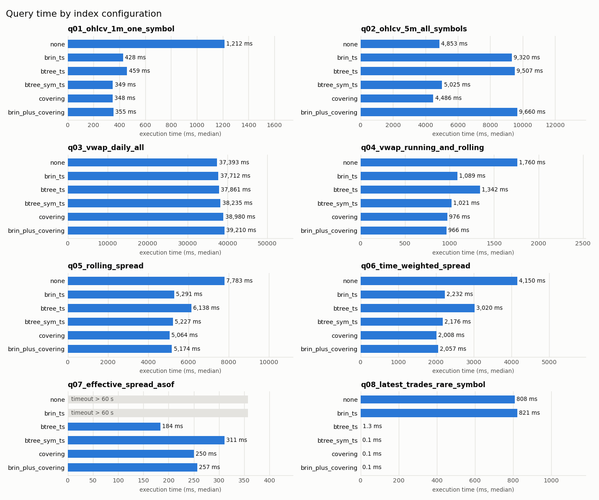
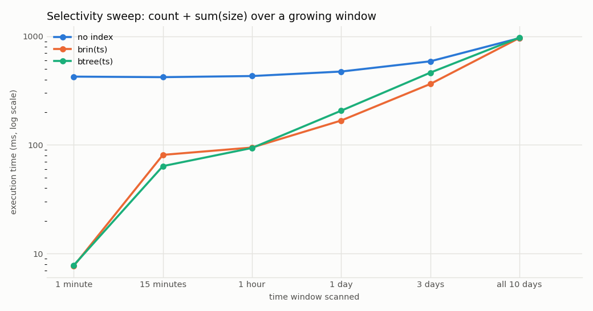

# Benchmark results

PostgreSQL 16.2, median of 3 warm runs (after one warm-up run). Parameters: `{'day': '2026-03-04', 'symbol': 'MSFT', 'rare_symbol': 'DDOG'}`.

| table | rows | heap size |
|---|---:|---:|
| trades | 15,066,061 | 981.1 MB |
| quotes | 40,508,160 | 2.58 GB |

## Query x index configuration



### Indexes built per configuration

| configuration | index | build time | size |
|---|---|---:|---:|
| none | (none) | | |
| brin_ts | `trades_ts_brin` | 3.9 s | 48 KB |
| brin_ts | `quotes_ts_brin` | 11.5 s | 104 KB |
| btree_ts | `trades_ts_btree` | 8.3 s | 322.7 MB |
| btree_ts | `quotes_ts_btree` | 24.1 s | 867.7 MB |
| btree_sym_ts | `trades_sym_ts` | 23.4 s | 453.2 MB |
| btree_sym_ts | `quotes_sym_ts` | 72.2 s | 1.19 GB |
| covering | `trades_sym_ts_cov` | 33.1 s | 844.9 MB |
| covering | `quotes_sym_ts_cov` | 77.6 s | 1.87 GB |
| brin_plus_covering | `trades_ts_brin` | 3.9 s | 48 KB |
| brin_plus_covering | `quotes_ts_brin` | 10.9 s | 104 KB |
| brin_plus_covering | `trades_sym_ts_cov` | 26.7 s | 844.9 MB |
| brin_plus_covering | `quotes_sym_ts_cov` | 71.8 s | 1.87 GB |

### Execution time (ms)

| query | none | brin_ts | btree_ts | btree_sym_ts | covering | brin_plus_covering |
|---|---:|---:|---:|---:|---:|---:|
| q01_ohlcv_1m_one_symbol | 1,212 | 428 (2.8x) | 459 (2.6x) | 349 (3.5x) | 348 (3.5x) | 355 (3.4x) |
| q02_ohlcv_5m_all_symbols | 4,853 | 9,320 (0.5x) | 9,507 (0.5x) | 5,025 (1.0x) | 4,486 (1.1x) | 9,660 (0.5x) |
| q03_vwap_daily_all | 37,393 | 37,712 (1.0x) | 37,861 (1.0x) | 38,235 (1.0x) | 38,980 (1.0x) | 39,210 (1.0x) |
| q04_vwap_running_and_rolling | 1,760 | 1,089 (1.6x) | 1,342 (1.3x) | 1,021 (1.7x) | 976 (1.8x) | 966 (1.8x) |
| q05_rolling_spread | 7,783 | 5,291 (1.5x) | 6,138 (1.3x) | 5,227 (1.5x) | 5,064 (1.5x) | 5,174 (1.5x) |
| q06_time_weighted_spread | 4,150 | 2,232 (1.9x) | 3,020 (1.4x) | 2,176 (1.9x) | 2,008 (2.1x) | 2,057 (2.0x) |
| q07_effective_spread_asof | timeout (>60 s) | timeout (>60 s) | 184 | 311 | 250 | 257 |
| q08_latest_trades_rare_symbol | 808 | 821 (1.0x) | 1.3 (613.9x) | 0.1 (8693.1x) | 0.1 (11549.4x) | 0.1 (9981.0x) |

Speed-up in parentheses is relative to `none`.

### Plans and buffers

Buffers = shared blocks hit + read (8 KB pages touched). Full plans: `results/plans/`.

#### q01_ohlcv_1m_one_symbol

| configuration | ms | buffers | rows removed by filter | access path |
|---|---:|---:|---:|---|
| none | 1,212 | 125,840 | 14,878,550 | Seq Scan [trades] |
| brin_ts | 428 | 12,625 | 1,300,455 | Bitmap Heap Scan [trades]<br>Bitmap Index Scan [trades_ts_brin] |
| btree_ts | 459 | 20,128 | 1,300,455 | Index Scan [trades_ts_btree] |
| btree_sym_ts | 349 | 13,122 | 0 | Bitmap Heap Scan [trades]<br>Bitmap Index Scan [trades_sym_ts] |
| covering | 348 | 1,344 | 0 | Index Only Scan [trades_sym_ts_cov] |
| brin_plus_covering | 355 | 1,344 | 0 | Index Only Scan [trades_sym_ts_cov] |

#### q02_ohlcv_5m_all_symbols

| configuration | ms | buffers | rows removed by filter | access path |
|---|---:|---:|---:|---|
| none | 4,853 | 125,872 | 13,578,095 | Seq Scan [trades] |
| brin_ts | 9,320 | 12,565 | 0 | Bitmap Heap Scan [trades]<br>Bitmap Index Scan [trades_ts_brin] |
| btree_ts | 9,507 | 16,468 | 0 | Index Scan [trades_ts_btree] |
| btree_sym_ts | 5,025 | 125,872 | 13,578,095 | Seq Scan [trades] |
| covering | 4,486 | 125,872 | 13,578,095 | Seq Scan [trades] |
| brin_plus_covering | 9,660 | 12,565 | 0 | Bitmap Heap Scan [trades]<br>Bitmap Index Scan [trades_ts_brin] |

#### q03_vwap_daily_all

| configuration | ms | buffers | rows removed by filter | access path |
|---|---:|---:|---:|---|
| none | 37,393 | 125,584 | 0 | Seq Scan [trades] |
| brin_ts | 37,712 | 125,584 | 0 | Seq Scan [trades] |
| btree_ts | 37,861 | 125,584 | 0 | Seq Scan [trades] |
| btree_sym_ts | 38,235 | 125,584 | 0 | Seq Scan [trades] |
| covering | 38,980 | 125,584 | 0 | Seq Scan [trades] |
| brin_plus_covering | 39,210 | 125,584 | 0 | Seq Scan [trades] |

#### q04_vwap_running_and_rolling

| configuration | ms | buffers | rows removed by filter | access path |
|---|---:|---:|---:|---|
| none | 1,760 | 125,840 | 14,878,550 | Seq Scan [trades] |
| brin_ts | 1,089 | 12,625 | 1,300,455 | Bitmap Heap Scan [trades]<br>Bitmap Index Scan [trades_ts_brin] |
| btree_ts | 1,342 | 16,468 | 1,300,454 | Index Scan [trades_ts_btree] |
| btree_sym_ts | 1,021 | 13,122 | 0 | Index Scan [trades_sym_ts] |
| covering | 976 | 1,344 | 0 | Index Only Scan [trades_sym_ts_cov] |
| brin_plus_covering | 966 | 1,344 | 0 | Index Only Scan [trades_sym_ts_cov] |

#### q05_rolling_spread

| configuration | ms | buffers | rows removed by filter | access path |
|---|---:|---:|---:|---|
| none | 7,783 | 337,792 | 39,922,870 | Seq Scan [quotes] |
| brin_ts | 5,291 | 33,450 | 3,408,870 | Bitmap Heap Scan [quotes]<br>Bitmap Index Scan [quotes_ts_brin] |
| btree_ts | 6,138 | 44,192 | 3,408,870 | Index Scan [quotes_ts_btree] |
| btree_sym_ts | 5,227 | 35,521 | 0 | Index Scan [quotes_sym_ts] |
| covering | 5,064 | 3,526 | 0 | Index Only Scan [quotes_sym_ts_cov] |
| brin_plus_covering | 5,174 | 3,526 | 0 | Index Only Scan [quotes_sym_ts_cov] |

#### q06_time_weighted_spread

| configuration | ms | buffers | rows removed by filter | access path |
|---|---:|---:|---:|---|
| none | 4,150 | 337,792 | 39,922,870 | Seq Scan [quotes] |
| brin_ts | 2,232 | 33,450 | 3,408,870 | Bitmap Heap Scan [quotes]<br>Bitmap Index Scan [quotes_ts_brin] |
| btree_ts | 3,020 | 44,192 | 3,408,870 | Index Scan [quotes_ts_btree] |
| btree_sym_ts | 2,176 | 35,521 | 0 | Index Scan [quotes_sym_ts] |
| covering | 2,008 | 3,526 | 0 | Index Only Scan [quotes_sym_ts_cov] |
| brin_plus_covering | 2,057 | 3,526 | 0 | Index Only Scan [quotes_sym_ts_cov] |

#### q07_effective_spread_asof

| configuration | ms | buffers | rows removed by filter | access path |
|---|---:|---:|---:|---|
| none | timeout (>60 s) | - | - | - |
| brin_ts | timeout (>60 s) | - | - | - |
| btree_ts | 184 | 77,900 | 195,783 | Index Scan [trades_ts_btree]<br>Index Scan [quotes_ts_btree] |
| btree_sym_ts | 311 | 76,342 | 0 | Bitmap Heap Scan [trades]<br>Bitmap Index Scan [trades_sym_ts]<br>Index Scan [quotes_sym_ts] |
| covering | 250 | 60,333 | 0 | Index Only Scan [trades_sym_ts_cov]<br>Index Only Scan [quotes_sym_ts_cov] |
| brin_plus_covering | 257 | 60,333 | 0 | Index Only Scan [trades_sym_ts_cov]<br>Index Only Scan [quotes_sym_ts_cov] |

#### q08_latest_trades_rare_symbol

| configuration | ms | buffers | rows removed by filter | access path |
|---|---:|---:|---:|---|
| none | 808 | 125,808 | 15,014,805 | Seq Scan [trades] |
| brin_ts | 821 | 125,808 | 15,014,805 | Seq Scan [trades] |
| btree_ts | 1.3 | 91 | 6,262 | Index Scan [trades_ts_btree] |
| btree_sym_ts | 0.1 | 19 | 0 | Index Scan [trades_sym_ts] |
| covering | 0.1 | 19 | 0 | Index Scan [trades_sym_ts_cov] |
| brin_plus_covering | 0.1 | 19 | 0 | Index Scan [trades_sym_ts_cov] |

## Experiments: when indexes don't help

### When the bottleneck isn't the scan: q03's sort and its group estimate

```sql
-- Daily VWAP and volume for every symbol over the whole dataset.
-- Reads every trade: no index can make "touch all rows" cheaper than a sequential scan.
SELECT ts::date                        AS day,
       symbol,
       sum(price * size) / sum(size)   AS vwap,
       sum(size)                       AS volume,
       count(*)                        AS n_trades
FROM trades
GROUP BY 1, 2
ORDER BY 1, 2;

```

| variant | ms | buffers | rows removed (filter / recheck) | lossy blocks | access path |
|---|---:|---:|---:|---:|---|
| as-is (planner guesses ~15M groups) | 38,238 | 125,584 | 0 / 0 | 0 | Seq Scan [trades] |
| CREATE STATISTICS on (ts::date, symbol) | 3,038 | 125,648 | 0 / 0 | 0 | Seq Scan [trades] |
| as-is, symbol compared with C collation | 24,013 | 125,584 | 0 / 0 | 0 | Seq Scan [trades] |

### B-tree on a low-cardinality column (side = 'B'/'S')

```sql
SELECT count(*), sum(size) FROM trades WHERE side = 'B'
```

| variant | ms | buffers | rows removed (filter / recheck) | lossy blocks | access path |
|---|---:|---:|---:|---:|---|
| no index | 1,124 | 125,584 | 7,531,365 / 0 | 0 | Seq Scan [trades] |
| btree(side), planner's choice | 1,113 | 125,584 | 7,531,365 / 0 | 0 | Seq Scan [trades] |
| btree(side), seq scan disabled | 786 | 137,991 | 0 / 0 | 0 | Index Scan [trades_side] |

Indexes: `trades_side` 99.6 MB (8.1 s)

### BRIN on a column that is not physically ordered (symbol)

```sql
SELECT count(*), sum(size) FROM trades WHERE symbol = 'DDOG'
```

*pg_stats.correlation*: `{'symbol': 0.107, 'ts': 1.0}`  

| variant | ms | buffers | rows removed (filter / recheck) | lossy blocks | access path |
|---|---:|---:|---:|---:|---|
| no index | 560 | 125,584 | 15,014,805 / 0 | 0 | Seq Scan [trades] |
| brin(symbol) | 694 | 125,589 | 0 / 3,002,961 | 29,929 | Bitmap Heap Scan [trades]<br>Bitmap Index Scan [trades_sym_brin] |
| brin(symbol), seq scan disabled | 698 | 125,589 | 0 / 3,002,961 | 30,007 | Bitmap Heap Scan [trades]<br>Bitmap Index Scan [trades_sym_brin] |
| btree(symbol) | 94.8 | 41,921 | 0 / 0 | 0 | Bitmap Heap Scan [trades]<br>Bitmap Index Scan [trades_sym_btree] |

Indexes: `trades_sym_brin` 48 KB (12.6 s), `trades_sym_btree` 99.6 MB (14.1 s)

### Functions on the indexed column (non-sargable predicates)

```sql
SELECT count(*), sum(size) FROM trades WHERE date_trunc('hour', ts) = '2026-03-04 10:00'
```

| variant | ms | buffers | rows removed (filter / recheck) | lossy blocks | access path |
|---|---:|---:|---:|---:|---|
| date_trunc('hour', ts) = ...  with btree(ts) | 742 | 125,584 | 14,842,590 / 0 | 0 | Seq Scan [trades] |
| ts >= ... AND ts < ...  with btree(ts) | 73.4 | 2,703 | 0 / 0 | 0 | Index Scan [trades_ts_btree] |
| date_trunc('hour', ts) = ...  with expression index | 68.2 | 2,097 | 0 / 0 | 0 | Index Scan [trades_hour_expr] |

Indexes: `trades_ts_btree` 322.7 MB (7.0 s), `trades_hour_expr` 99.6 MB (5.5 s)

### Selectivity sweep: how wide can the window get before indexes stop helping?

```sql
SELECT count(*), sum(size) FROM trades WHERE ts >= '2026-03-02 09:30' AND ts < timestamp '2026-03-02 09:30' + interval '<window>'
```



| variant | ms | buffers | rows removed (filter / recheck) | lossy blocks | access path |
|---|---:|---:|---:|---:|---|
| no index | 1 minute | 426 | 125,584 | 15,042,950 / 0 | 0 | Seq Scan [trades] |
| no index | 15 minutes | 421 | 125,584 | 14,930,805 / 0 | 0 | Seq Scan [trades] |
| no index | 1 hour | 431 | 125,584 | 14,728,735 / 0 | 0 | Seq Scan [trades] |
| no index | 1 day | 474 | 125,584 | 13,514,835 / 0 | 0 | Seq Scan [trades] |
| no index | 3 days | 589 | 125,584 | 10,515,735 / 0 | 0 | Seq Scan [trades] |
| no index | all 10 days | 964 | 125,584 | 0 / 0 | 0 | Seq Scan [trades] |
| brin(ts) | 1 minute | 7.7 | 277 | 0 / 7,750 | 256 | Bitmap Heap Scan [trades]<br>Bitmap Index Scan [trades_ts_brin] |
| brin(ts) | 15 minutes | 81.0 | 1,173 | 0 / 626 | 1,152 | Bitmap Heap Scan [trades]<br>Bitmap Index Scan [trades_ts_brin] |
| brin(ts) | 1 hour | 94.7 | 2,837 | 0 / 147 | 2,092 | Bitmap Heap Scan [trades]<br>Bitmap Index Scan [trades_ts_brin] |
| brin(ts) | 1 day | 168 | 12,949 | 0 / 56 | 4,176 | Bitmap Heap Scan [trades]<br>Bitmap Index Scan [trades_ts_brin] |
| brin(ts) | 3 days | 364 | 38,037 | 0 / 2,348 | 8,937 | Bitmap Heap Scan [trades]<br>Bitmap Index Scan [trades_ts_brin] |
| brin(ts) | all 10 days | 967 | 125,584 | 0 / 0 | 0 | Seq Scan [trades] |
| btree(ts) | 1 minute | 7.8 | 257 | 0 / 0 | 0 | Index Scan [trades_ts_btree] |
| btree(ts) | 15 minutes | 63.8 | 1,498 | 0 / 0 | 0 | Index Scan [trades_ts_btree] |
| btree(ts) | 1 hour | 93.8 | 4,216 | 0 / 0 | 0 | Index Scan [trades_ts_btree] |
| btree(ts) | 1 day | 207 | 20,991 | 0 / 0 | 0 | Index Scan [trades_ts_btree] |
| btree(ts) | 3 days | 463 | 62,359 | 0 / 0 | 0 | Index Scan [trades_ts_btree] |
| btree(ts) | all 10 days | 974 | 125,584 | 0 / 0 | 0 | Seq Scan [trades] |

Indexes: `trades_ts_brin` 48 KB (3.1 s), `trades_ts_btree` 322.7 MB (6.9 s)

### BRIN pages_per_range trade-off (1-hour window)

```sql
SELECT count(*), sum(size) FROM trades
WHERE ts >= '2026-03-04 10:00' AND ts < '2026-03-04 11:00'
```

| variant | ms | buffers | rows removed (filter / recheck) | lossy blocks | access path |
|---|---:|---:|---:|---:|---|
| pages_per_range=8 | 86.2 | 1,992 | 0 / 262 | 1,660 | Bitmap Heap Scan [trades]<br>Bitmap Index Scan [trades_ts_brin_8] |
| pages_per_range=32 | 91.1 | 1,957 | 0 / 1,414 | 1,691 | Bitmap Heap Scan [trades]<br>Bitmap Index Scan [trades_ts_brin_32] |
| pages_per_range=128 | 95.3 | 2,069 | 0 / 4,486 | 1,893 | Bitmap Heap Scan [trades]<br>Bitmap Index Scan [trades_ts_brin_128] |
| pages_per_range=512 | 82.8 | 2,050 | 0 / 4,486 | 1,548 | Bitmap Heap Scan [trades]<br>Bitmap Index Scan [trades_ts_brin_512] |

Indexes: `trades_ts_brin_8` 536 KB (3.1 s), `trades_ts_brin_32` 144 KB (3.1 s), `trades_ts_brin_128` 48 KB (3.1 s), `trades_ts_brin_512` 24 KB (3.0 s)

### BRIN depends on physical row order (1-hour window, shuffled copy)

```sql
SELECT count(*), sum(size) FROM <table>
WHERE ts >= '2026-03-04 10:00' AND ts < '2026-03-04 11:00'
```

*pg_stats.correlation(ts)*: `{'trades': 1.0, 'trades_shuffled': -0.002}`  

| variant | ms | buffers | rows removed (filter / recheck) | lossy blocks | access path |
|---|---:|---:|---:|---:|---|
| time-ordered table, brin(ts) | 84.8 | 2,069 | 0 / 4,486 | 1,649 | Bitmap Heap Scan [trades]<br>Bitmap Index Scan [trades_ts_brin] |
| shuffled table, brin(ts) | 898 | 125,568 | 14,842,590 / 0 | 0 | Seq Scan [trades_shuffled] |
| shuffled table, brin(ts), seq scan disabled | 663 | 125,573 | 0 / 2,968,518 | 32,084 | Bitmap Heap Scan [trades_shuffled]<br>Bitmap Index Scan [trades_shuf_ts_brin] |
| shuffled table, btree(ts) | 344 | 223,940 | 0 / 0 | 0 | Index Scan [trades_shuf_ts_btree] |

Indexes: `trades_ts_brin` 48 KB (3.1 s), `trades_shuf_ts_brin` 48 KB (4.3 s), `trades_shuf_ts_btree` 322.7 MB (9.2 s)

